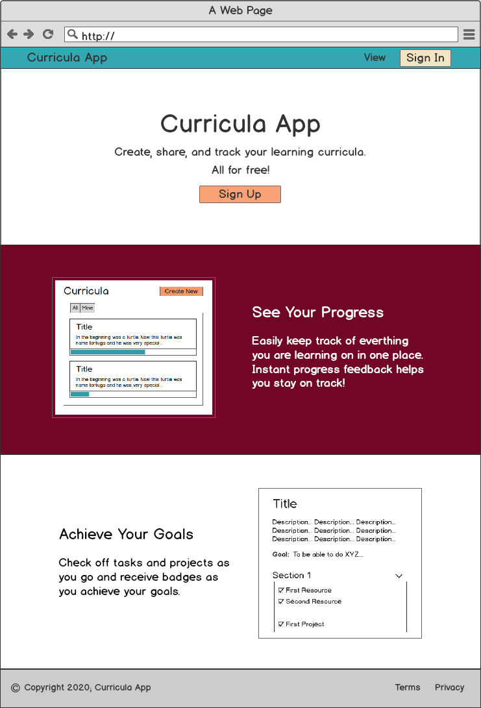
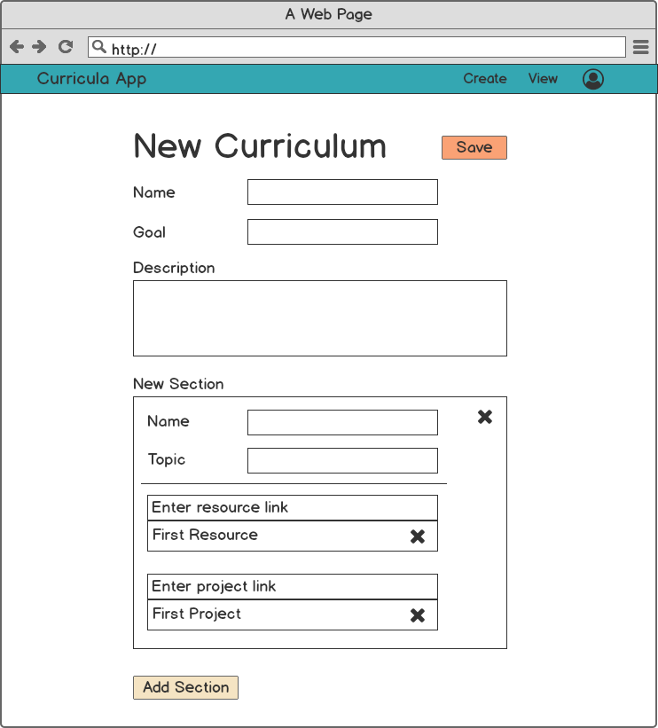
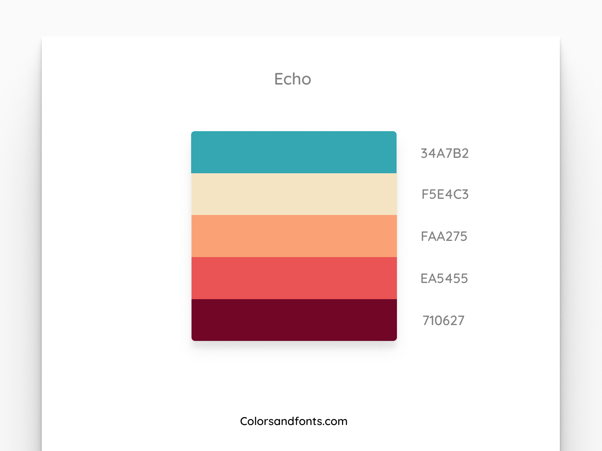

# Curriculum App

*This project is currently in beta and hosted at: [studytracker.tech](https://studytracker.tech). See the [version 1 roadmap here](https://github.com/faraday-academy/curriculum-app/projects/1).*

This app allows users to create their own learning curriculum. They can then keep track of their progress, share it with friends, and make changes as they go along.

To see the playlist where I livestream the building of this app, [click here](https://www.youtube.com/playlist?list=PLFBirL3MAv2-c8VpBJMvH8Hci975MLVU1).

## Table of Contents

1. [Running Locally](#running-locally)
1. [Tech Stack](#tech-stack)
1. [Mockups](#mockups)
1. [Design](#design)
1. [Routes](#routes)
1. [Schema](#schema)
1. [API](#api)
1. [MVP Features](#mvp-features)
1. [Version 1 Features](#version-1-features)

## Running Locally

### Run the Front-End

1. Clone this repo
1. `cd curriculum-front`
1. `npm i`
1. `npm run serve`

### Run the Back-End

1. Open another terminal tab or window
1. `cd curriculum-back`
1. `npm run setup`
1. `npm start`

## Tech Stack

1. Vue.js/Vue Router/Vuex
1. Vuetify
1. Node.js/Express.js
1. MongoDB/Mongoose
1. Digital Ocean (hosting)

## Mockups

  

  

  

  

## Design

Color Palette:

710627 - EA5455 - FAA275 - F5E4C3 - 34A7B2

## Routes

* / --> Home Page/Landing Page
* curricula --> shows all curricula
* curricula/create --> shows form to create
* curricula/id --> shows single curriculum
* curricula/id/update --> update single curriculum

## Schema

**Curriculum**

* id: UUID (pk)
* name: string
* goal: string
* description: string
* sections: [object]
    * name: string
    * resources: [object]
        * isCompleted: boolean (default: false)
        * name: string
        * url: string
    * projects:  [object]
        * isCompleted: boolean (default: false)
        * name: string
        * url: string
* createdBy: Mongo object id (userId, foreign key)
* createdAt: timestamp
* updatedAt: timestamp

**User**

* username: String
* email: String
* password: String (hashed password)
* isVerified: Boolean
* createdAt: timestamp
* updatedAt: timestamp

**Verification**

*This is just to store and expire verification codes that are sent to user by email.*

* userId: Mongo object id (userId, foreign key)
* code: Number

## API

**Prefix:** `/api/v1`

**Endpoints:**

`/curricula`

* get
* post

`/curricula/:id`

* get
* patch
* delete

`/count`

*get the ratio of completed tasks for each curriculum*

* get

## MVP Features

1. Home Page with list of curriculums
1. Form Page to create/update a curriculum
1. User can delete a curriculum

## Version 1 Features

1. Users can log in and save their curricula
1. Users can fork other users curricula
